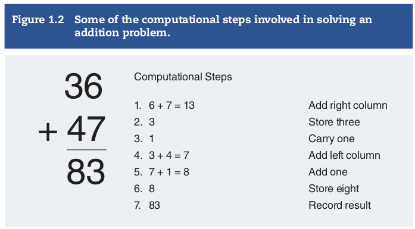
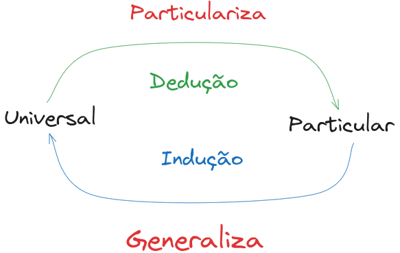

# Cognitive Science. An Introduction to the study of mind. 4th Edition 
- Autor(es): Friedenberg, J.; Silverman, G.; Spivey, M. J.
- Título: Cognitive Science: An Introduction to the Study of Mind
- Edição: 4ª ed.
- Local de Publicação: Thousand Oaks, California
- Editora: SAGE Publications, Inc.
- Ano de Publicação: 2022

# INTRODUCTION
# What is Decicion Science
Cognitive science é o campo científico interdisciplinar do estudo da mente. Os campos da filosofia, psicologia, linguística, inteligência artificial, robótica, neurociência, entre outros convergem e cooperam entre si trazendo suas especialidades, ferramentas e perspectivas para o estudo da mente.

A mente, sob uma perspectiva teórica, surge da ideia de **computação** ou **processamento de informação**. Cientistas cognitivos vêem a mente como um processador de informação que a representa e transforma. Ou seja, incorpora **representações mentais de informações** e as processa manipulando informações. Essa perspectiva tem forte influência do desenvolvimento de computadores, e de forma análoga (muito abstrata e imperfeita) a ele, podemos pensar que a mente recebe inputs de informações através da **percepção**, armazena em nossas **memórias** e processa na forma de **pensamentos**. Esses pensamentos servem de base para os outputs, que se manifestam através do comportamento físico e linguagem.

## Representation
_Representation_ é algo que retrata alguma coisa, ou seja, é **simbólica (symbolic)**. Um símbolo é uma entidade que existe na mente. Esse processo de representar informações se divide em 4 categorias:
- **Concept**: Conceitos são entidades únicas ou grupos de entidades. Exemplo: A palavra "maçã" se refere a todas as maçãs que existem, não à uma específica. É um conceito.
- **Propositions**: Proposições são afirmações sobre o mundo, ilustradas através de sentenças. Proposições são representações que incorporam conceios. Exemplo: "Hoje choveu".
- **Rules**: Regras especificam o relacionamento entre proposições. Exemplo: "Se chover, então vou levar meu guarda-chuva"
- **Analogy**: Analogia é a comparação entre situações similares

Existem 4 aspectos cruciais em qualquer representação:
1 - Um agente deve executar a representação, seja humano ou computador
2 - A representação deve ter conteúdo e significado que se refere a um ou mais objetos, chamados de _referents_.
3 - A representação deve ser fundamentada, ou seja, deve relação relacional entre a representação e o _referent_.
4 - A representação deve ser interpretável por outro agente, seja humano ou computador.

As representações mentais humanas são chamadas de **semânticas**, porquê possuem significado, principalmente as representações linguísticas. O significado de uma representação mental deriva do relacionamento entre ela mesma e o seu referent, ou seja, sobre o que ela diz. Essa relação é chamada de **intencionalidade (intencionality)**. É a direção para um objeto. Os estados mentais e eventos são intencionais, eles se referem a alguma coisa ou coisas no mundo. Essa intencionalidade provoca um comportamento ou ação que está relacionado ao referente.

Friedenberg, Silverman e Spivey (2022)

Os símbolos são agrupados e combinados em **sistemas lógicos formais**. Nesses sistemas, os simbolos são combinados em expressões, expressões que podem ser manipuladas através de processos, resultando em novas expressões. Na lógica formal, símbolos podem ser palavras como "animais" e "humanos" e expressões como "animais bebem água". O processo seriam as regras de dedução, que permitem derivar conclusões verdadeiras de expressões conhecidas. Se "animais bebem água" e "humanos são animais", logo "humanos bebem água".

## Computation
Nossa mente performa computações com essas representações mentais, desde operações matemáticas como adição, subitração, divisão, etc, além de fazer com a linguagem como conjugações verbais, e a lista de possíveis computações possíveis é infinita. Por isso, é melhor pensar em operações mentais como operações de categorias mais amplas. Essas categorias são definidas pelo tipo de operação performada ou pelo tipo de informação em que agiu sobre. Algumas dessas operações mentais incluem **sensação, percepção, atenção, memória, linguagem, raciocínio matemático, raciocínio lógico, tomada de decisão e resolução de problemas**.

Esse processamento de informações, de computação, pode ser descrito de diferentes níveis. E, de acordo com o **Tri-level hypotesis** (uma ferramenta de estudo da cognição), processamentos de informação biológicos ou artificiais podem ser avaliados em pelo menos três níveis:
- **Nível computacional**: Nesse nível mais alto e abstrato, estamos focados em especificiar claramente o problema, e, quebra-lo em seus principais componentes. Aqui, o objetivo é descrever o problema de forma precisa, para que o problema possa ser investigado utilizando métodos formais. Além disso buscamos o propósito ou razão para esse processo, por quê ele é necessário.
- **Nível algorítmico**: Nesse segundo nível menos abastrato, utilizamos procedimentos formais, **algoritmos**, para atuar nas representações mentais de informação. Aqui, algoritmos podem ser executados independente do sentido e significado de uma representação. **Os algoritmos agem na forma**, não no significado dos símbolos que eles transformam. Uma forma de pensar algoritmos são as etapas que são utilizadas pra manipular e alterar representações. São os passos de processamento de informação para resolução de problemas.

Friedenberg, Silverman e Spivey (2022)

- **Nível implementacional**: Essa é a etapa mais concreta, as vezes chamada de **hardware level**, em que do que é feito o processador de informação e quais mudanças físicas ou materiais afetam o processamento de informações. Assim como um computador é composto de várias partes de hardware, o nosso hardware biológico cognitivo é o cérebro e nosso corpo, que numa escala menor, é composto de neurônios e a atividade sinapticas deles. 

Essa forma de particionar a análise do processamento de informações nesses 3 níveis é criticado por ser fundamentalmente simplista, já que os níveis interagem entre si. E cada um poderia facilmente gerar diversas subdivisões, mas para fins didáticos, é uma ótima ferramenta.

# APPROACHES
Como dito anteriormente, Ciência Cognitiva é o campo científico interdisciplinar do estudo da mente, composta de várias abordagens, composta de **suas interações**, e os maiores avanços sobre a compreensão da mente surgiram dessa cooperação interdisciplinar. As maiores contribuições teóricas de cada abordagem são brevemente descritas em termos de perspectiva, história e metodologia.

## The Philosofical Approach
A abordagem filosófica tem suas origens na Grécia antiga, com os filósofos buscando responder desde as questões mais básicas sobre a realidade e universo. Essa bordagem é livre pra estudar qualquer tipo de questão sobre qualquer tema. Desde a natureza da **aquisição do conhecimento** até a política, ética e beleza. Os **filósofos da mente**, dirigem seu foco em problemas sobre a natureza e característica da mente. Eles buscam responder o que é a mente, como sabemos aprendemos as coisas, como o conhecimento mental é organizado, etc.

O método primário da abordagem filosófica é o raciocínio, seja ele dedutivo ou indutivo. O **raciocínio dedutivo** é a aplicação de regras de lógica em afirmações sobre o mundo, dado um conjunto inicial de afirmações (premissas) assumidas como verdadeiras, podemos derivar outras afirmações que logicamente devem ser corretas. Já no **raciocínio indutivo**, são feitas observações sobre o mundo, e ao perceber pontos em comuns, podemos generalizar as conclusões.

Um dos principais problemas abordados pela filosofia da mente é o problema mente-corpo. Que busca definir o que é a mente, se ela faz parte do corpo, se faz, qual parte exatamente está localizada ou é a mente, e caso não seja algo físico, o que exatamente ela é. Isso é feito através das perspectivas do monismo, dualismo, e funcionalismo. Outro problema abordado é o da aquisição do conhecimento.

## The Psychological Approach
## The Cognitive Approach ?
## The Neuroscience Approach ?
## The Linguistic Approach
## The Artificial Intelligence Approach
## The Robotics Approach

# References
FRIEDENBERG, Jay; SILVERMAN, Gordon; SPIVEY, Michael J. Cognitive Science: An Introduction to the Study of Mind. 4ª ed. Thousand Oaks, California: SAGE Publications, Inc., 2022.

